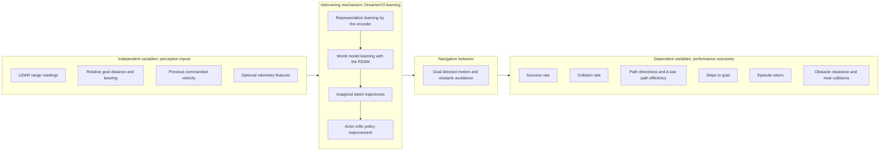

# Conceptual Framework

This document presents a research conceptual framework for the DreamerV3-based
autonomous mobile robot navigation study. It organises the study into
**independent variables** (the inputs/features the agent perceives), an
**intervening learning mechanism** (the DreamerV3 model-based learning process),
and **dependent variables** (the measured navigation and performance outcomes).
Every variable listed is grounded in the current implementation.

## Conceptual diagram

## Independent variables (perception inputs)

These are the features that constitute the agent's observation. They are the
levers a researcher can vary to study their effect on navigation performance.

| Variable | Description | Present in code |
|---|---|---|
| **LiDAR range readings** | A vector of laser distances around the robot, with out-of-range values clamped to the maximum range. | Yes, observation key `sensor_readings`. |
| **Relative goal distance and bearing** | The Euclidean distance and the bearing angle from the robot to the goal, computed in the robot frame from odometry pose and the spawned goal. | Yes, observation key `target`. |
| **Previous commanded velocity** | The linear and angular velocity command issued on the previous step. | Yes, observation key `velocity`. |
| **Optional odometry features** | An optional appended block of odometry-derived features under modes named twist, delta, full, or full_imu (full_imu also adds 2-D linear acceleration from the IMU). | Yes, optional observation key `odometry`. |

All perception inputs are normalised with a hyperbolic-tangent transform into a
bounded range before being given to the agent. The raw robot pose itself is
**not** an input variable to the policy; it is used only to derive the relative
goal features and to compute path-length metrics.

> Scope note: the **odometry feature block** is an **optional ablation
> dimension**. In the baseline configuration the odometry mode is `none` and the
> key is absent. It is included here as an independent variable because the code
> supports it, but it is a separate experimental factor.

## Intervening mechanism (DreamerV3 model-based learning)

The learning mechanism is the process that transforms perception inputs into
navigation behaviour. In DreamerV3 this is explicitly **model-based**:

1. **Representation learning.** The encoder compresses each observation into a
   latent embedding that captures the task-relevant structure of the LiDAR,
   goal, and velocity features.
2. **World model learning.** The RSSM learns the latent **dynamics** — how the
   state evolves given actions — together with heads that reconstruct the
   observation and predict reward and episode continuation. This yields an
   internal predictive model of the navigation environment.
3. **Imagined trajectories.** Using the learned model, the agent rolls out
   **imagined** future latent states and predicted rewards, decoupling policy
   improvement from costly real interaction.
4. **Actor-critic policy improvement.** A critic estimates returns along the
   imagined rollouts and an actor is optimised to maximise those returns,
   yielding the control policy that is then deployed back into the simulation.

This mechanism is the **intervening process**: it mediates the relationship
between the perception inputs and the navigation outcomes. Improvements in the
quality of the world model and the policy are expected to manifest as
improvements in the dependent variables.

## Navigation behavior

The immediate behavioural product of the mechanism is **goal-directed motion
with obstacle avoidance**: the robot turns toward and advances to the goal while
keeping clear of obstacles sensed by the LiDAR. This behaviour is the bridge
between the latent learning mechanism and the externally observable performance
outcomes.

## Dependent variables (performance outcomes)

These are the measured outcomes recorded by the logging system. They operationalise
"good navigation" and are the quantities reported in results.

| Variable | Definition in code | Source CSV |
|---|---|---|
| **Success rate** | Fraction (or cumulative percentage) of episodes ending by reaching the goal acceptance radius. | black-box |
| **Collision rate** | Percentage of episodes ending in a collision. | black-box |
| **Path directness** | Initial straight-line distance divided by the actual path length, capped at one. | black-box |
| **A\* path efficiency** | Planned shortest-path length divided by actual path length, a stronger optimality measure than path directness. | planning |
| **Steps to goal** | Number of control steps taken on a successful episode. | black-box |
| **Episode return** | Accumulated reward per episode, summarised as training and evaluation returns. | white-box |
| **Obstacle clearance and near-collisions** | Minimum obstacle distance over an episode and a count of steps spent closer than a near-collision threshold. | black-box |

Algorithm-internal quantities (world-model loss, actor loss, value loss, latent
KL, prior/posterior entropies, reward variance) are also logged as **white-box**
diagnostics of the learning mechanism itself.

## Relationship statement (thesis-ready)

> In this study, the **independent variables** are the agent's perception inputs
> — LiDAR range readings, the relative goal distance and bearing, the previous
> commanded velocity, and an optional odometry feature block. These inputs are
> processed by an **intervening learning mechanism**, the DreamerV3 model-based
> reinforcement learning process, which performs representation learning,
> world-model learning, imagination-based planning, and actor-critic policy
> improvement. The mechanism produces goal-directed obstacle-avoiding navigation
> behaviour, whose quality is captured by the **dependent variables**: success
> rate, collision rate, path directness, A\* path efficiency, steps to goal,
> episode return, and obstacle clearance. The study examines how the model-based
> learning mechanism converts the perception inputs into measurable improvements
> in these navigation outcomes, optionally under reward-shaping interventions
> intended to improve path efficiency without degrading success.

> Excluded by scope: no model-free baseline (TD3, DDPG, SAC, DQN) is part of this
> conceptual framework; the framework concerns the DreamerV3 navigation agent only.
