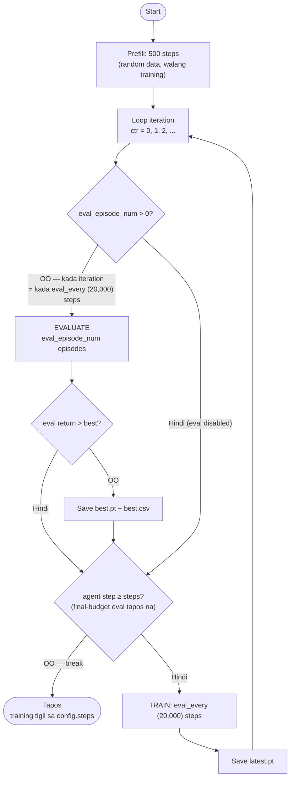
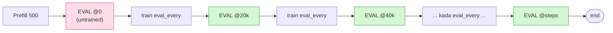

# Evaluation Loop & Training Parameters

How a training run actually proceeds — prefill, the train/eval cycle, how often
evaluation happens, and every parameter that controls it. Grounded on
[dreamer.py](../dreamerv3-torch/dreamer.py) and
[configs.yaml](../dreamerv3-torch/configs.yaml).

> **Changed 2026-06-12:** the hardcoded `ctr % 4` multiplier was removed
> ([dreamer.py:294](../dreamerv3-torch/dreamer.py#L294)) so **`eval_every` alone
> controls the evaluation interval** — one clean knob. The default `eval_every`
> is **20,000** steps ([configs.yaml:12](../dreamerv3-torch/configs.yaml#L12),
> `2e4`), which preserves the original effective interval (the old code used
> `5,000 × 4 = 20,000`). **Lower** `eval_every` for a finer learning curve.
>
> **Changed 2026-06-13:** training now **stops exactly at `config.steps`**. The loop
> bound stays `config.steps + eval_every` (so the model *at* `config.steps` still gets
> evaluated), but a `break` fires **right after that final eval, before training**
> ([dreamer.py:317](../dreamerv3-torch/dreamer.py#L317)). Previously the loop trained
> one **extra `eval_every` round past `--steps`** that no eval ever measured (e.g.
> `--steps 80000` actually trained ~100k — ~20k wasted/run). Eval checkpoints and BO
> scoring are **unchanged**; only the wasted post-final-eval tail is removed.

---

## 1. The parameters

| Parameter | Value (turtle) | Source | What it controls |
|---|---|---|---|
| `prefill` | 500 | [configs.yaml:39](../dreamerv3-torch/configs.yaml#L39) | Random steps collected **once** before any training (seeds the replay buffer). |
| `eval_every` | **20,000** (`2e4`) | [configs.yaml:12](../dreamerv3-torch/configs.yaml#L12) | Size of **one training round** **and** the **evaluation interval** (one round per iteration, eval each iteration). |
| `eval_episode_num` | 100 (default); **20** in BO trials | [configs.yaml:13](../dreamerv3-torch/configs.yaml#L13) | Episodes run **per evaluation**. `0` disables eval. |
| `steps` | 600,000 | [configs.yaml:108](../dreamerv3-torch/configs.yaml#L108) | Total training budget. With `--configs turtle` and **no** `--steps`, this is **600k** (overrides the `defaults:` 300k at [configs.yaml:10](../dreamerv3-torch/configs.yaml#L10)). |
| `action_repeat` | 1 | [configs.yaml:110](../dreamerv3-torch/configs.yaml#L110) | Env steps per agent action. `eval_every` and `time_limit` are divided by this. |
| `time_limit` | 250 | [configs.yaml:38](../dreamerv3-torch/configs.yaml#L38) | Max steps per **episode** before timeout. |
| `train_ratio` | 512 | [configs.yaml:78](../dreamerv3-torch/configs.yaml#L78) | Replay ratio → how often a gradient update fires. |
| `batch_size` × `batch_length` | 16 × 64 = 1024 | [configs.yaml:76-77](../dreamerv3-torch/configs.yaml#L76) | `batch_steps`; with `train_ratio` sets the update cadence. |

**Derived — gradient-update cadence:**
`_should_train = Every(batch_steps / train_ratio) = Every(1024 / 512) = Every(2)`
([dreamer.py:35-36](../dreamerv3-torch/dreamer.py#L35)) → **one gradient update every 2 env steps**.
So a 20,000-step round = **10,000 updates** between evaluations.

---

## 2. The loop



Source: [dreamer.py:286-335](../dreamerv3-torch/dreamer.py#L286).

Key points:
- **Prefill runs once** ([dreamer.py:263](../dreamerv3-torch/dreamer.py#L263)) — 500 random steps, no learning.
- **Eval happens before training** within each iteration, **every iteration**
  ([dreamer.py:294](../dreamerv3-torch/dreamer.py#L294)) — i.e. every `eval_every` (20,000) steps.
- **Training stops exactly at `config.steps`**: after the final-budget eval, a `break`
  fires before the next training round ([dreamer.py:317](../dreamerv3-torch/dreamer.py#L317)),
  so there is **no wasted `eval_every`-sized tail** past `--steps` (changed 2026-06-13).
- **`best.pt`** is saved only when the mean eval return beats the previous best;
  **`latest.pt`** is saved after each **training** round (so it reflects the
  `config.steps` model, not a post-budget overshoot).
- The first eval (`ctr=0`) runs on an **untrained** agent (post-prefill) — one
  throwaway at the very start.

---

## 3. Eval interval = `eval_every` = 20,000 steps (default)

**Number of evals** (including the untrained `ctr=0`):

```
n_evals ≈ steps / eval_every + 1   =   steps / 20,000 + 1
```

| `--steps` | Evals (trained-step marks) | Total eval episodes (eval=20) |
|---|---|---|
| 40,000 | 0, 20k, 40k → **3** | 60 |
| 60,000 | 0, 20k, 40k, 60k → **4** | 80 |
| 300,000 | ~16 | ~320 (eval=20) / ~1,600 (eval=100) |
| 600,000 | ~31 | ~620 (eval=20) / ~3,100 (eval=100) |

**Alignment:** since the interval is 20k, the eval marks land at multiples of
20,000. As of **2026-06-13**, training **stops exactly at `config.steps`** — the loop
breaks right after the final-budget eval ([dreamer.py:317](../dreamerv3-torch/dreamer.py#L317)),
so there is **no extra training round past `--steps`** (the old behavior trained up to
one more `eval_every` round, i.e. `--steps 80000` actually ran ~100k). Prefer `--steps`
as a **multiple of 20,000** (40k, 60k, 300k, …) so the final eval lands exactly on the
budget instead of mid-interval.

---

## 4. One knob: `eval_every` (the `% 4` was removed)

Before 2026-06-12 the eval gate was `ctr % 4 == 0` (with a comment that was wrong
on both counts — it claimed "every 8 trains" and "skips the first eval"). That made
two knobs multiply (`eval_every × 4`). Removing it makes **`eval_every` the single,
honest control**, and the default value `20,000` keeps the original effective
interval, so existing behavior is unchanged.

**Want a finer learning curve?** Lower `eval_every`:

| `--eval_every` | Eval interval | Evals in a 40k run | Trade-off |
|---|---|---|---|
| **20,000** (default) | 20k steps | 3 | fewer pauses, coarse curve |
| 10,000 | 10k steps | 5 | balance |
| 5,000 | 5k steps | 9 | fine curve, more eval pauses |



> The `ctr=0` untrained eval still exists — a single throwaway at the start.
> `tune_reward.py` does **not** expose `--eval_every`, so BO trials use the config
> default (20,000): an 80k trial → 5 evals → ~100 eval episodes (a 40k trial → 3
> evals → ~60).

---

## 5. How eval feeds scoring & metrics

- Eval episodes are written to `blackbox_eval_*` / `planning_eval_*`
  (see the CSV-logging section of `CLAUDE.md`).
- The BO tuner scores from the **last 60 eval rows** (`SCORE_WINDOW = 60`,
  [tune_reward.py:54](../dreamerv3-torch/tune_reward.py#L54)). With the default 20k
  interval and `eval=20`, an **80k** trial has 5 evals (100 rows); the last 60 rows
  are the **last 3 trained evals (40k/60k/80k checkpoints)** — the untrained `ctr=0`
  eval is excluded. **This assumes BO trials run ≥80k steps** (≥5 evals): a 40k trial
  has only 3 evals (60 rows), so a 60-row window would reach the untrained `ctr=0`
  eval and pollute the score — use `--steps ≥80000` for BO, or lower `SCORE_WINDOW`
  for shorter trials. If you raise `--eval_episode_num`, raise `SCORE_WINDOW` in
  proportion.
- **Eval has high per-episode variance** (efficiency std ≈ 0.3), so eval sample
  size matters: 20–40 episodes only resolve *coarse* differences; use
  `--eval_episode_num 100` (+ multiple seeds, averaged) for reported numbers. See
  [training_convergence.md](training_convergence.md).
- Two data streams: **train** metrics are per-episode (fine-grained, used by the
  🎯 Convergence dashboard tab); **eval** metrics are periodic (every `eval_every`).

---

## 6. Buod (Tagalog)

- **Prefill 500 steps** (isang beses) → tapos umiikot: **eval → train `eval_every` → ulit**.
- **`eval_every` na lang ang kontrol** sa dalas ng eval (inalis ang `% 4` noong
  2026-06-12). **Default = 20,000** steps — kaya **eval kada 20k** (tulad ng dati).
- Para sa **mas pinong curve**, **babaan** ang `eval_every` (hal. `--eval_every 5000`
  → 9 evals sa 40k). Para sa **mas kaunting pause**, itaas.
- Ang **unang eval (ctr=0)** ay untrained pa — isang throwaway lang sa umpisa.
- **Training tigil sa `config.steps`** (mula 2026-06-13): pagkatapos ng final eval, may
  `break` bago mag-train ulit — kaya **walang sayang na `eval_every`-sized na tail** lampas
  sa `--steps` (dati, ang `--steps 80000` ay totoong nag-train ng ~100k). Hindi nagbabago
  ang eval checkpoints o BO scoring — ang sayang na tail lang ang tinanggal.
- **BO trials:** hindi ipinapasa ng tuner ang `--eval_every`, kaya 20,000 (default).
  Ang `SCORE_WINDOW = 60` ay nag-i-score sa **huling 3 trained evals** — kaya gamitin
  ang **`--steps ≥80000`** sa BO (80k → 5 evals; window 60 = 40k/60k/80k, excluded
  ang untrained `ctr=0`). Ang 40k trial (3 evals, 60 rows) ay kasama ang untrained.
- Piliin ang `--steps` na **multiple ng 20,000** para maganda ang align ng eval.
