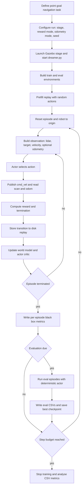

# Methodology

This chapter documents the methodology of the **DreamerV3-based autonomous mobile
robot navigation** study. It is written to be thesis-ready (Chapter 3 style) and
is grounded strictly in the repository implementation as recorded in
[implementation_audit.md](implementation_audit.md). Throughout, every claim is
labelled by confidence:

- **implemented** — direct, unambiguous code evidence.
- **inferred from implementation** — reasoned from code but not stated explicitly.
- **not found in the current implementation** — no supporting code or config located.

Features that the audit marked as *not found* are listed under
[Methodological Scope and Limitations](#14-methodological-scope-and-limitations)
rather than presented as part of the method.

---

## 1. Research Design

This study uses a **quantitative, simulation-based experimental design** to
investigate model-based deep reinforcement learning for autonomous point-goal
navigation with obstacle avoidance. A single TurtleBot3 (burger) robot operates
in a ROS2 and Gazebo simulation and learns, from range-sensing observations, a
continuous-control policy that drives it from a fixed start position to a
randomly spawned goal while avoiding obstacles.

The learning agent is **DreamerV3**, a model-based reinforcement learning method
that learns a latent world model of the environment and improves its policy
primarily inside imagined rollouts of that model. The design is **agent-centric
and single-environment**: one synchronous environment instance interacts with one
agent process (**implemented**; the `turtle` configuration uses `envs: 1`).

The design supports three optional experimental conditions, each isolated so that
the core agent, observation space, and action space remain unchanged:

- **Arena complexity** — eight progressively harder stages (1 to 8) selectable
  with a `--stage` argument (**implemented**; stages 1 to 8 supported after the
  2026-06-09 goal-sampler extension).
- **Reward condition** — a sparse `default` reward or an additive `shaped` reward
  (**implemented**).
- **Observation condition (odometry ablation)** — five observation variants
  `none`, `twist`, `delta`, `full`, `full_imu` (**implemented**; `full_imu` adds
  2-D linear acceleration from `/imu` on top of `full`).

A separate outer-loop **Bayesian-optimisation** procedure can tune the shaped
reward weights (**implemented**, but as a tuning layer external to the agent —
see Section 7 and Section 14).

The study is **descriptive and comparative within DreamerV3**: it characterises
how the model-based learning mechanism converts perception inputs into navigation
performance, and it compares conditions (stage, reward mode, observation mode)
against one another. It is **not** a cross-algorithm comparison; legacy
model-free methods are out of scope (see Section 14).

---

## 2. Implementation Basis

The methodology is derived from the following source files, which constitute the
evidence base for every subsequent section. The table mirrors the audit inventory.

| File | Role | Confidence |
|---|---|---|
| `dreamerv3-torch/dreamer.py` | Training and evaluation entry point; `Dreamer` agent; `make_env`; config and CLI merge; main loop; checkpointing. | implemented |
| `dreamerv3-torch/configs.yaml` | `defaults` and `turtle` configuration blocks. | implemented |
| `dreamerv3-torch/envs/turtle.py` | ROS2 `Env(Node)` and `Turtle(gym.Env)`: observation and action spaces, reward, termination, goal sampling, CSV logging. | implemented |
| `dreamerv3-torch/models.py` | `WorldModel` and `ImagBehavior` (actor and critic over imagined rollouts). | implemented |
| `dreamerv3-torch/networks.py` | Neural blocks: RSSM, MultiEncoder and MultiDecoder, MLP, GRUCell. | implemented |
| `dreamerv3-torch/tools.py` | `simulate()` driver, disk-backed replay, `Logger` (white-box CSV). | implemented |
| `dreamerv3-torch/envs/stage_map.py` | Stage arena geometry and the A-star planner for the path-efficiency metric. | implemented |
| `dreamerv3-torch/envs/path_viz.py` | Per-episode overhead path plots. | implemented |
| `dreamerv3-torch/envs/resource_logger.py` | Per-episode CPU, RAM, and GPU resource logging. | implemented |
| `dreamerv3-torch/envs/wrappers.py` | Gym wrappers; only `UUID` is applied for this task. | implemented |
| `dreamerv3-torch/dashboard/app.py` | Streamlit monitoring dashboard over the CSV logs. | implemented |
| `dreamerv3-torch/tune_reward.py` | Optuna Bayesian-optimisation of shaped-reward weights; wraps `dreamer.py`. | implemented |
| `dreamerv3-torch/exploration.py` | Exploration behaviours; default `greedy`, others inactive. | implemented but inactive by default |

Legacy model-free implementations under `model_free/` and the root-level scripts
are **excluded** as out of scope; they are not called by the DreamerV3 workflow
(**implemented**, confirmed by repository-wide search in the audit).

---

## 3. Simulation Environment

**Implemented.** The agent interacts with a Gazebo physics simulation through
ROS2, mediated by `Env(Node)` and `Turtle(gym.Env)` in `envs/turtle.py`.

- **Robot and arena.** A TurtleBot3 burger robot is placed in a stage arena. Eight
  stages of increasing obstacle complexity are supported (stages 1 to 8). Stage
  geometry is defined in `envs/stage_map.py` (`STAGE_ARENAS`, `STAGE_OBSTACLES`)
  and mirrored by the Gazebo world and obstacle SDF files. Stage 7 is a five by
  five metre arena with six inner walls; stage 8 is a seven and a half by seven
  and a half metre empty arena.
- **ROS2 interface.** The environment publishes velocity commands to `/cmd_vel`
  and subscribes to the laser scanner `/scan` and odometry `/odom` (and the IMU
  `/imu` in the `full_imu` mode). It uses the
  services `/reset_simulation`, `/spawn_entity`, `/delete_entity`,
  `/pause_physics`, `/unpause_physics`, and entity-state services for the goal
  marker.
- **Reset logic.** Each episode begins by resetting the simulation; the robot
  returns to the origin at coordinates zero, zero. Reset is stage-independent
  (**implemented**, no stage-specific reset branch).
- **Goal logic.** A goal position is sampled per episode by
  `_sample_target_position` and validated by `generate_random_target_position`,
  which enforces a minimum distance from the origin and retries up to a fixed
  number of attempts before falling back to the farthest candidate. The goal is
  spawned as a cylinder marker entity matching the goal acceptance radius. Goal
  sampling covers stages 1 to 8; an unrecognised stage raises a `ValueError`
  (**implemented**).
- **Episode setup.** An episode runs as a sequence of control steps until one of
  three terminal conditions fires (see Section 8). The robot pose from `/odom` is
  used only to derive the relative-goal features and the path-length metrics; the
  raw pose is **never** passed to the policy (**inferred from implementation**).

---

## 4. Robot Platform and Sensor Inputs

**Implemented.** The robot is a **TurtleBot3 burger** differential-drive platform
in simulation. The sensor inputs actually used by the agent are:

- **LiDAR** from `/scan`. The raw scan is sub-sampled evenly to a configurable
  number of beams (`lidar`, default 360; a reduced setting such as 10 is also
  supported). Out-of-range or infinite readings are clamped to the maximum LiDAR
  range of three and a half metres.
- **Odometry** from `/odom`. Odometry is used in two ways: to compute the
  relative-goal features and path-length metrics in all configurations, and,
  optionally, to provide an explicit odometry feature block in the observation
  when an odometry mode other than `none` is selected (see Section 5).
- **Inertial measurement** from `/imu` — used **only** in the `full_imu` odometry
  mode, contributing 2-D robot-frame linear acceleration (`accel_x`, `accel_y`) to
  the `(7,)` odometry block. The `/imu` subscription is created only in this mode;
  gyro and vertical acceleration are excluded (near-zero information on a flat 2-D arena).

The simulation also publishes an IMU topic, but the agent does **not** subscribe
to it for control, and **no camera or depth sensor is used for control**
(**implemented**; the encoder is MLP-only and the image observation entry is an
unused placeholder).

---

## 5. Observation Space

**Implemented.** The observation is a dictionary space (`Turtle.observation_space`)
built in `Env.get_state`. All components are normalised with a hyperbolic-tangent
transform into a bounded range before use.

| Key | Shape | Contents | Source |
|---|---|---|---|
| `sensor_readings` | `(lidar,)`, default `(360,)` | LiDAR ranges sub-sampled to `lidar` beams; infinities clamped to the maximum range. | `/scan` |
| `target` | `(2,)` | Relative goal: distance to target and bearing to target in the robot frame, wrapped to plus or minus pi. | derived from `/odom` pose and goal |
| `velocity` | `(2,)` | Previous **commanded** linear and angular action, not measured velocity. | previous action |
| `odometry` | `(2,)`, `(3,)`, `(5,)`, or `(7,)` | **Optional**, present only when the odometry mode is not `none`. | `/odom` (and `/imu` for `full_imu`) |

Internally the environment builds a flat vector of length `lidar + 4`, composed of
the LiDAR readings followed by distance to target, bearing to target, linear
velocity command, and angular velocity command, then applies the tanh transform;
the `Turtle` wrapper slices this vector back into the dictionary keys.

**Observation variants (odometry ablation, implemented).** The observation differs
only by the optional `odometry` key:

| Mode | `odometry` key | Contents |
|---|---|---|
| `none` (default) | absent | Baseline observation, unchanged. |
| `twist` | `(2,)` | Odometry linear x and angular z. |
| `delta` | `(3,)` | Local-frame delta x, delta y, delta yaw. |
| `full` | `(5,)` | Twist and delta concatenated. |
| `full_imu` | `(7,)` | `full` plus 2-D robot-frame linear acceleration (`accel_x`, `accel_y`) from `/imu`. Gyro and vertical acceleration are excluded (near-zero information on a flat 2-D arena). |

A non-encoded `image` entry filled with zeros and the boolean flags `is_first`,
`is_last`, and `is_terminal` are also returned, but `image` is **not** part of
`observation_space` and is not encoded (**inferred from implementation**).

---

## 6. Action Space and Robot Control

**Implemented.** The action space is a two-dimensional continuous box
(`Turtle.action_space`):

| Index | Range | Role |
|---|---|---|
| `action[0]` | 0 to 1 | Forward throttle (magnitude used). |
| `action[1]` | minus 1 to 1 | Steering or turn command. |

The action is mapped to a ROS2 `Twist` velocity in `publish_action` and published
to `/cmd_vel`:

```
linear_vel  = abs(action[0]) * 0.1      # up to 0.1 metres per second
angular_vel = action[1] * 2 * 0.1       # up to plus or minus 0.2 radians per second
publish Twist with linear x equal to linear_vel and angular z equal to angular_vel
```

The same two action values become the next observation's `velocity` key, giving
the agent access to its previous command. Constants `num_states` equal to 14 and
unused action-bound constants exist in the environment initialisation but do not
size the runtime spaces (**inferred from implementation**: legacy and unused).

---

## 7. DreamerV3 Learning Framework

**Implemented.** DreamerV3 is realised by `WorldModel` and `ImagBehavior` in
`models.py`, with neural blocks in `networks.py` and the orchestration in
`dreamer.py`. The workflow has the following components, each supported by the
audit:

1. **Environment interaction.** The `Dreamer` agent selects an action for each
   observation; the `tools.simulate()` driver steps the environment and collects
   transitions.
2. **Replay and data collection.** Completed episodes are written to disk as
   compressed archives under the run's `train_eps/` and `eval_eps/` directories
   and loaded into a bounded in-memory cache. Training batches are fixed-length
   sub-sequences sampled from the stored episodes. The buffer is **disk-backed**
   and bounded by a configured dataset size; older episodes are erased once the
   bound is exceeded.
3. **World-model learning.** A MultiEncoder maps the dictionary observation to an
   embedding; a Recurrent State-Space Model maintains a latent state combining a
   deterministic recurrent component and a discrete stochastic component; and
   decoder, reward, and continue heads reconstruct the observation and predict
   reward and episode continuation. The world model is trained on replay batches
   by minimising reconstruction, reward, continuation, and latent KL objectives.
4. **Imagined rollouts.** Starting from posterior latent states, the agent imagines
   trajectories forward using the learned model, without touching the simulator.
5. **Actor learning.** The actor is optimised to maximise the returns estimated
   along the imagined rollouts.
6. **Critic or value learning.** A critic estimates state values over the imagined
   rollouts; bootstrapped lambda-returns provide the regression targets, and a
   slow target network is used for stability.
7. **Policy action selection.** At each environment step the observation is encoded
   and the latent state advanced; the actor produces an action that is **sampled**
   during training (for exploration) and taken at its **deterministic mode** during
   evaluation.

The configured exploration behaviour is `greedy`, meaning the task actor itself is
used for data collection; alternative exploration behaviours exist in
`exploration.py` but are **not** active by default (**inferred from implementation**).

> **Bayesian optimisation is not part of DreamerV3.** The Optuna tuning layer
> described in Section 14 wraps the DreamerV3 training run from the outside; it
> does not modify the world model, actor, critic, observation space, or action
> space.

---

## 8. Training Procedure

**Implemented.** Training is launched through `dreamer.py`. The canonical command
pattern is:

```
python3 dreamer.py --configs turtle --task turtle \
  --logdir ./logdir/<run_name> \
  --stage <N> --lidar <360|10> --odometry_mode <none|twist|delta|full|full_imu> \
  --seed <S> --device <cpu|cuda> [--steps <int>] [--eval_episode_num <int>] \
  [--reward_mode <default|shaped>] [--reward_* <float> ...]
```

The training procedure proceeds as follows:

1. **Configuration.** The `defaults` and `turtle` blocks of `configs.yaml` are
   merged and every merged key is auto-registered as a typed command-line argument,
   so any value is CLI-overridable. Representative `turtle` settings:

   | Parameter | Value | Meaning |
   |---|---|---|
   | `steps` | 600000 (turtle) | Total environment-step budget. |
   | `time_limit` | 250 | Per-episode step horizon before action-repeat division. |
   | `action_repeat` | 1 | Action repeat; the effective maximum is 250 steps. |
   | `prefill` | 500 | Random-action steps before learning. |
   | `batch_size` | 16 | Replay batch size. |
   | `batch_length` | 64 | Sub-sequence length per batch element. |
   | `train_ratio` | 512 | Update-to-collected-step ratio. |
   | `pretrain` | 100 | One-off pre-training updates before interaction. |
   | `dyn_deter` | 256 | RSSM deterministic state size. |
   | `dyn_stoch`, `dyn_discrete` | 16, 16 | Discrete stochastic latent. |
   | `discount` | 0.997 | Reward discount factor. |
   | `discount_lambda` | 0.95 | Lambda-return mixing. |
   | `imag_horizon` | 15 | Imagined-rollout length. |
   | `eval_every` | 20000 (`2e4`) | Evaluation cadence in steps (was 5000 before the 2026-06-12 `% 4` removal; the multiplier `5000 × 4` is now folded into the single value). |
   | `eval_episode_num` | 100 | Evaluation episodes per checkpoint. |

2. **Initialisation and prefill.** Two environments are built — a training
   environment and an evaluation environment — and a short prefill phase drives the
   training environment with random actions to seed the replay buffer.
3. **Resume.** If a `latest.pt` checkpoint exists in the logdir, training resumes
   from it.
4. **Episode loop.** Within each training phase the environment is reset, the agent
   observes, selects a sampled action, the simulator is stepped, and reward and
   done are computed. Model updates are scheduled relative to collected steps via
   the train ratio, with a larger pre-training burst before the first interaction.
5. **Reward.** Computed in `get_reward_and_done` once per step (see Section 10 and
   the reward table below).
6. **Termination and horizon.** Three mutually exclusive terminal outcomes
   (**implemented**), with a **config-driven** horizon:

   | Condition | Test | Reward (default mode) | Outcome label |
   |---|---|---|---|
   | Success | distance to goal below the acceptance radius of 0.4 metres | plus 100 | `success` |
   | Collision | minimum LiDAR range below the collision threshold of 0.13 metres (just above the 0.12 m LiDAR floor; near-contact) | minus 10 | `collision` |
   | Timeout | step counter reaches the per-episode step limit | minus 10 | `timeout` |
   | Non-terminal | none of the above | 0 | none |

   The horizon is the `time_limit` value divided by `action_repeat` and is enforced
   by an internal step-counter check, not by a gym `TimeLimit` wrapper (which exists
   but is not applied — **inferred from implementation**).

   **Optional reward shaping** (`reward_mode` equal to `shaped`) leaves the terminal
   rewards unchanged and **adds** four per-step terms:

   | Term | Formula | Default weight |
   |---|---|---|
   | Progress | scale times prev distance minus current distance | `reward_progress_scale` equal to 1.0 |
   | Step penalty | minus step penalty | `reward_step_penalty` equal to 0.01 |
   | Turn penalty | minus turn penalty times absolute angular action | `reward_turn_penalty` equal to 0.01 |
   | Near-obstacle | minus scale times exp of minus d_min over sigma when d_min below 0.2 metres | `reward_near_obstacle_scale` equal to 0.1, `reward_near_obstacle_sigma` equal to 0.25 |

   In `default` mode these terms are all zero, so the reward is exactly the original
   sparse signal.
7. **Model update.** Each update has a world-model part (encoder, RSSM, and heads
   trained on a replay batch) and an actor-critic part (imagined rollouts, critic
   regression to lambda-returns, and actor improvement).
8. **Evaluation trigger.** On its periodic schedule the loop runs the evaluation
   procedure (Section 9).
9. **Logging and checkpointing.** Per-episode behavioural metrics and per-step
   algorithm metrics are written to CSV (Section 11 and Section 12). After each
   phase the agent state is saved to `latest.pt`, and the best-mean-evaluation-return
   checkpoint is saved separately as `best.pt`.

---

## 9. Evaluation Procedure

**Implemented.** Evaluation runs periodically inside the main loop on a separate
evaluation environment, using the **deterministic** actor (its mode rather than a
sample). A fixed number of evaluation episodes (`eval_episode_num`, default 100)
is run; no model update occurs during evaluation. Evaluation episodes are scored
independently and written to parallel `*_eval` CSV files, and the checkpoint with
the best mean evaluation return is preserved as `best.pt`.

Evaluation uses the same observation construction, action mapping, reward, and
termination logic as training; the only differences are the deterministic action
selection, the absence of model updates, and the separate output files
(**implemented**).

---

## 10. Experimental Variables

The table below lists only variables confirmed or inferred in the audit.
Variable types follow standard methodology: **independent** variables are
manipulated across runs; the **intervening** variable is the learning mechanism;
**dependent** variables are measured outcomes; **controlled** variables are held
fixed.

| Variable Type | Variable or Component | Operational Definition | Evidence from Audit or Code | Role in the Study |
|---|---|---|---|---|
| Independent | Arena stage | Stage number 1 to 8 selecting arena size and obstacle layout. | `--stage`; `STAGE_ARENAS` and `_sample_target_position` (stages 1 to 8). | Manipulated difficulty condition. |
| Independent | Reward mode | `default` sparse reward or `shaped` additive reward. | `reward_mode` in `configs.yaml`; branch in `get_reward_and_done`. | Reward intervention condition. |
| Independent | Observation mode (odometry ablation) | `none`, `twist`, `delta`, `full`, or `full_imu` odometry feature block (`full_imu` = `full` + 2-D `/imu` linear acceleration). | `odometry_mode`; observation-space branches in `turtle.py`. | Perception-input condition. |
| Independent | LiDAR resolution | Number of LiDAR beams (`lidar`, default 360). | `lidar` config; sub-sampling in `get_state`. | Perception-fidelity condition. |
| Independent | Random seed | Integer seed for reproducibility across runs. | `seed` config. | Repetition and variance control. |
| Independent (outer loop) | Shaped-reward weights | Five scalar weights tuned by Optuna. | `tune_reward.py`, `--reward_*` flags. | Tuning of the shaping intervention. |
| Intervening | DreamerV3 learning mechanism | World-model learning, imagination, actor-critic improvement. | `models.py`, `networks.py`. | Mediates inputs into behaviour. |
| Dependent | Success rate | Fraction or percentage of episodes reaching the goal. | black-box CSV. | Primary task-success outcome. |
| Dependent | Collision rate | Percentage of episodes ending in collision. | black-box CSV. | Safety outcome. |
| Dependent | Path directness | Initial straight-line distance over actual path length, capped at one. | black-box CSV. | Coarse path-quality outcome. |
| Dependent | A-star path efficiency | Planned shortest-path length over actual path length (region and centre variants). | planning CSV. | Primary path-quality outcome. |
| Dependent | Steps to goal | Control steps on a successful episode. | black-box CSV. | Efficiency outcome. |
| Dependent | Episode return | Accumulated reward per episode (train and eval). | white-box CSV. | Learning-progress outcome. |
| Dependent | Obstacle clearance and near-collisions | Minimum obstacle distance and count of close steps. | black-box CSV. | Safety-margin outcome. |
| Controlled | Robot platform | TurtleBot3 burger. | `turtle.py`, Gazebo assets. | Held fixed across runs. |
| Controlled | Action mapping | Linear up to 0.1 metres per second, angular up to plus or minus 0.2 radians per second. | `publish_action`. | Held fixed across runs. |
| Controlled | Reset behaviour | Robot returns to origin each episode. | `Env` reset logic. | Held fixed across runs. |
| Controlled | Episode horizon | 250-step limit (`time_limit` over `action_repeat`). | `configs.yaml`, step-counter check. | Held fixed across runs. |

---

## 11. Performance Metrics

**Implemented.** The implementation deliberately separates **black-box**
behavioural metrics from **white-box** algorithm-internal metrics, and separates
training episodes from evaluation episodes.

### Black-box metrics (per episode, written by the environment)

Files `blackbox_{run}.csv` (training) and `blackbox_eval_{run}.csv` (evaluation).

| Metric | Research meaning |
|---|---|
| `outcome` | Terminal label: success, collision, or timeout. |
| `steps_to_goal` | Control steps taken, an efficiency indicator. |
| `path_directness` | Initial distance over actual path length, capped at one; coarse straightness. |
| `min_obstacle_dist` | Closest approach to an obstacle; a safety margin. |
| `near_collisions` | Number of steps spent closer than a near-collision threshold. |
| `success_rate`, `collision_rate` | Cumulative task-success and safety rates. |
| rolling rates over 100 and 500 episodes | Recent performance, less sensitive to early episodes. |

### White-box metrics (per logging step, written by the Logger)

File `whitebox_{run}.csv`: `train_return`, `reward_variance`, `model_loss`,
`actor_loss`, `value_loss`, `kl`, `prior_ent`, `post_ent`, `eval_return`,
`eval_success_rate`, `eval_collision_rate`. These expose **how the algorithm is
learning** — returns, the world-model loss, actor and value losses, latent KL
divergence, and prior and posterior entropies — alongside reward variance and
evaluation summaries.

> **Authoritative source for success and collision rates.** Report
> `success_rate` / `collision_rate` from the **black-box eval** CSV
> (`blackbox_eval_{run}.csv`), **not** from the white-box `eval_success_rate` /
> `eval_collision_rate` columns. The black-box outcome label is correct under both
> reward modes and keeps timeout, collision, and success separate. The white-box
> eval-rate columns are a quick monitor only and were unreliable in shaped-reward
> runs logged before the 2026-06-09 fix. Use white-box for the learning
> diagnostics (losses, KL, entropies, returns). See
> [whitebox_data_validation.md](whitebox_data_validation.md).

### Planning, reward-component, and resource metrics

- **Planning (A-star).** `planning_{run}.csv` and `planning_eval_{run}.csv` record
  the A-star path-efficiency metric — planned shortest-path length over actual path
  length, in a goal-region variant and a goal-centre variant — with start and goal
  coordinates and a planner status. This is a **reference and visualisation metric
  only**; it does not influence control, reward, observations, or the policy
  (**implemented as metric-only**).
- **Reward components.** `reward_{run}.csv` and `reward_eval_{run}.csv` record
  per-episode sums of the terminal and shaping reward terms, in both modes.
- **Resource.** `resource_{run}.csv` and `resource_eval_{run}.csv` record
  per-episode CPU, RAM, and GPU usage and timing.

The **primary** path-quality measure is the A-star path efficiency; path
directness is a coarser secondary measure (**implemented**).

---

## 12. Data Collection and Logging

**Implemented.** Per-run CSVs are written under a configurable base directory
(`csv_dir`, default `./csv_logs/`), with training and evaluation episodes routed
to separate files at environment-construction time. Up to nine CSVs are produced
per run (black-box, white-box, planning, reward, and resource, with `*_eval`
counterparts).

- **Per-episode metrics** are written by the environment (black-box, planning,
  reward, resource).
- **Interval and model diagnostics** are written by the `Logger` (white-box).
- **Visualisation.** When the A-star planner returns a valid path, a per-episode
  overhead plot is rendered showing the arena, the A-star reference path, the robot
  trajectory, and the goal, in separate training and evaluation folders.
- **Dashboard.** A Streamlit dashboard (`dashboard/app.py`) reads the black-box,
  white-box, planning, and resource CSVs and renders tabs and tables, with a sidebar
  folder picker to switch between `csv_logs/` and per-experiment subfolders.

> Note (fixed 2026-06-09): the white-box CSV now honours `csv_dir` and is written
> alongside the other per-run CSVs. Files created before the fix remain in the
> default `./csv_logs/` folder.

---

## 13. Data Analysis Procedure

The recorded metrics support the following analyses, each grounded in a logged
quantity (no analysis is proposed for a metric that is not logged):

- **Learning trend.** Plot `train_return` and the losses (`model_loss`,
  `actor_loss`, `value_loss`) against step to assess convergence.
- **Success trend.** Plot cumulative and rolling `success_rate` against episode or
  step to assess task acquisition. Source these from the **black-box** CSVs
  (`blackbox_eval_{run}.csv` for evaluation), not white-box.
- **Collision trend.** Plot cumulative and rolling `collision_rate` to assess safety
  over training, again from the **black-box** CSVs (the black-box `outcome` keeps
  collision and timeout distinct).
- **Reward trend.** Plot episode return and, in shaped mode, the per-component reward
  sums to attribute return to specific shaping terms.
- **Path quality.** Compare A-star path efficiency (primary) and path directness
  (secondary) across conditions to assess shortest-path behaviour.
- **Comparison across observation modes.** Compare the dependent variables across
  the odometry modes `none`, `twist`, `delta`, `full`, and `full_imu`, holding stage, reward
  mode, and seed fixed; the learning algorithm is identical and only the observation
  input changes.
- **Comparison across reward modes and stages.** Compare `default` versus `shaped`
  reward, and stage 1 to 8, on the same dependent variables.
- **Learning stability.** Use `reward_variance`, the latent `kl`, and the prior and
  posterior entropies as white-box stability indicators, and repeat runs across
  seeds to estimate variance.

A guard principle applies to the shaping experiments: improvements in path
efficiency are only accepted if success rate and collision rate do not regress.

---

## 14. Methodological Scope and Limitations

These limitations are grounded strictly in the implementation and the audit:

- **Single algorithm, no model-free baseline.** The study concerns DreamerV3 only.
  Legacy model-free implementations (TD3, DDPG, SAC) are present in the repository
  but are out of scope and are not comparison baselines (**implemented**). The
  Gazebo world names containing the token dqn are arena names only and imply no DQN
  algorithm.
- **Simulation only.** All results are obtained in Gazebo; no physical-robot
  deployment is implemented.
- **Range sensing only.** Control uses LiDAR, the relative goal, and the previous
  command (optionally plus odometry). **Depth-camera and CNN perception are not
  found in the current implementation**; the image observation entry is an unused
  placeholder.
- **A-star is a metric, not a planner-in-the-loop.** The A-star planner is used only
  to score path efficiency and to draw plots. **A-star-guided reward is not found in
  the current implementation.**
- **A-star accounts for the robot footprint (conservative).** Obstacles and the outer
  walls are inflated by `ROBOT_RADIUS = 0.15 m` (TurtleBot3 Burger ≈ 0.105 m + a
  0.045 m safety margin) on a 0.05 m grid before planning (configuration-space /
  Minkowski inflation in `build_grid`). The planner therefore keeps the robot centre
  ≥ 0.15 m from obstacles and routes through gaps only when wider than ~0.30 m.
  Because this radius exceeds the physical ~0.105 m, the planned path is always
  physically followable; in very narrow passages A-star reports `no_path` (blank
  efficiency) rather than overstating feasibility — it never returns a path the
  robot could not follow (**implemented**).
- **Reward modes are limited to two.** Only `default` and `shaped` exist; **traffic
  shaping and other reward modes are not found.**
- **Bayesian optimisation is an outer loop, not part of the agent.** Optuna tuning
  wraps `dreamer.py` and reads the eval CSVs to score candidates; it does not modify
  the world model, policy, observation space, or action space (**implemented**).
- **Exploration is greedy by default.** `Random` and `Plan2Explore` exist but are
  inactive under the default `expl_behavior` of greedy (**inferred from
  implementation**); confirm scope before claiming any non-greedy exploration.
- **Single synchronous environment.** One environment instance is used for the
  `turtle` task; parallel-environment drivers exist but are not used here.
- **White-box CSV path.** The white-box CSV now honours `csv_dir` (fixed
  2026-06-09); pre-fix files remain in the default `./csv_logs/` folder.
- **Per-stage Gazebo dependency.** Each stage requires its own Gazebo launch file,
  and the `--stage` argument must match the running simulation; the documentation
  does not run the simulator.

---

## 15. Reproducibility Notes

**Implemented.** The configuration and command conventions support reproducible runs.

- **Command pattern.** See Section 8. A smoke-test variant uses a small `--steps`
  and `--eval_episode_num` value.
- **Configuration.** All parameters live in `configs.yaml` (`defaults` plus
  `turtle`); any value is CLI-overridable because every merged key is auto-registered
  as a typed argument.
- **Seeds.** A `seed` parameter is exposed and threaded into the run; repeating a
  run with a different seed estimates variance, and the same seed reproduces a run.
- **Logdir naming convention.** Reward-shaping experiments follow
  `./logdir/stage{N}_360_none_seed{S}_reward_{default|shaped}`; odometry-ablation
  runs follow `./logdir/stage{N}_{lidar}_{mode}_seed{S}`. The run name used for CSV
  filenames is the final component of `--logdir`.
- **Resume.** A run resumes from `latest.pt` if present; the best evaluation
  checkpoint is preserved as `best.pt`.
- **Per-run CSVs and `csv_dir`.** Outputs are written under `csv_dir` (default
  `./csv_logs/`); a custom directory keeps experiments separate (with the white-box
  caveat in Section 12).
- **Tuning persistence.** The Optuna study is stored in a sqlite database with
  resume support, so an interrupted search continues rather than restarting.

---

## 16. Methodology Flowchart



> This flowchart summarises the implemented methodology. Optional conditions
> (reward shaping, odometry ablation, and Bayesian-optimisation weight tuning) are
> selected at the configuration step and do not change the loop structure.
