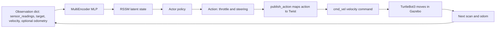

# Observation and Action Space

This document specifies the exact observation and action spaces used by the
current DreamerV3 navigation environment, as defined in
`dreamerv3-torch/envs/turtle.py`. All shapes, keys, ranges, and the
action-to-motion mapping are taken directly from the code.

## Observation space

The environment exposes a **dictionary** observation space
(`Turtle.observation_space`). For the default LiDAR resolution of 360 beams the
keys and shapes are:

| Key | Shape | Contents | Normalisation |
|---|---|---|---|
| `sensor_readings` | `(lidar,)` e.g. `(360,)` | LiDAR range readings, sub-sampled from the raw scan to `lidar` beams; out-of-range values clamped to the maximum range. | hyperbolic tangent |
| `target` | `(2,)` | Relative goal: `[distance_to_target, angle_to_target]` in the robot frame. | hyperbolic tangent |
| `velocity` | `(2,)` | Previous commanded velocity: `[linear_vel_cmd, angular_vel_cmd]`. | hyperbolic tangent |
| `odometry` | `(2,)`, `(3,)`, `(5,)`, or `(7,)` | **Optional**, present only when an odometry mode other than `none` is selected. | hyperbolic tangent |

The number of LiDAR beams is a configuration value (`lidar`, default `360`; a
reduced setting such as `10` is also supported). The full observation vector that
the environment constructs internally is therefore of length `lidar + 4`,
composed as:

```
state = [ lidar_0 ... lidar_{N-1} , distance_to_target , angle_to_target , linear_vel_cmd , angular_vel_cmd ]
state = tanh(state)
```

and the `Turtle` wrapper slices this vector back into the dictionary keys
`sensor_readings`, `target`, and `velocity`.

### How each component is computed

- **`sensor_readings` (LiDAR).** The raw `/scan` ranges are sub-sampled evenly to
  exactly `lidar` values; any infinite reading is replaced by the maximum LiDAR
  range (3.5 m) before normalisation.
- **`target` (relative goal).** From the odometry pose and the spawned goal, the
  environment computes the Euclidean `distance_to_target` and the
  `angle_to_target`, the latter being the goal bearing **relative to the robot's
  heading**, wrapped to the range minus pi to pi. The raw pose itself is never
  exposed to the policy.
- **`velocity` (previous action).** These are the **commanded** linear and
  angular action values from the previous step, not odometry-measured velocities.
- **`odometry` (optional).** Appended only in non-`none` modes:
  - `twist` -> `[odom_linear_x, odom_angular_z]`, shape `(2,)`
  - `delta` -> `[delta_x_local, delta_y_local, delta_yaw]`, shape `(3,)`
  - `full`  -> twist and delta concatenated, shape `(5,)`
  - `full_imu` -> `full` plus 2-D robot-frame linear acceleration `[accel_x, accel_y]` from `/imu`, shape `(7,)` (gyro and vertical acceleration excluded; the `/imu` subscription exists only in this mode)

### Baseline versus odometry-enhanced observation

- **Baseline observation** (`odometry_mode = none`, the default): only
  `sensor_readings`, `target`, and `velocity` are present. No odometry key is
  added; the observation space is unchanged.
- **Odometry-enhanced observation** (`twist`, `delta`, `full`, or `full_imu`): an additional
  `odometry` key is appended with the corresponding shape. This is a separate
  ablation dimension and each mode requires its own training run.

### Non-encoded placeholder

The observation dictionary returned at each step also contains an `image` entry
filled with zeros and several boolean flags (`is_first`, `is_last`,
`is_terminal`). The `image` entry is a **placeholder for interface
compatibility**: it is **not** part of `observation_space` and is **not** encoded
by the agent. No visual/CNN perception is used for control.

> Note (inferred from implementation): a constant `num_states = 14` and unused
> action-bound constants appear in the environment initialisation. They do **not**
> size the observation or action space at runtime; the authoritative sizes come
> from `observation_space` (`lidar + 4` features) and `action_space` (2 actions),
> and the authoritative action scaling comes from `publish_action()`.

## Action space

The action space is a 2-dimensional **continuous** box (`Turtle.action_space`):

| Index | Range | Role |
|---|---|---|
| `action[0]` | `[0, 1]` | Forward throttle (magnitude is used) |
| `action[1]` | `[-1, 1]` | Steering / turn command |

### Action-to-motion mapping

The environment converts the action into a ROS2 `Twist` velocity in
`publish_action()` and publishes it to `/cmd_vel`:

```
linear_vel  = abs(action[0]) * 0.1          # metres per second, up to 0.1
angular_vel = action[1] * 2 * 0.1           # radians per second, up to plus or minus 0.2
publish Twist(linear.x = linear_vel, angular.z = angular_vel) to /cmd_vel
```

Thus the robot drives forward at up to 0.1 m/s and turns at up to plus or minus
0.2 rad/s. The same `action[0]` and `action[1]` values are fed back into the next
observation as the `velocity` key, giving the agent access to its own last
command.

## Observation-to-action loop



This closed loop is the per-step interaction: the dictionary observation is
encoded into the RSSM latent state, the actor maps that latent state to a
continuous action, the environment converts the action to a velocity command,
the robot moves, and the resulting sensor readings form the next observation.
