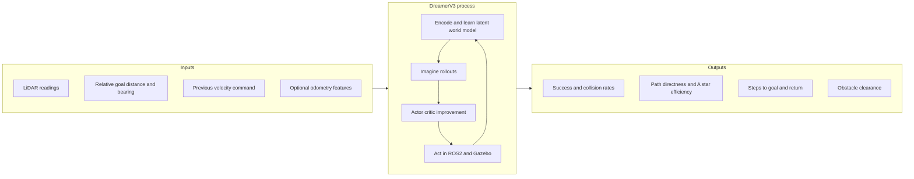

# Research Framework Summary

A condensed, thesis-ready synthesis of the DreamerV3-based autonomous mobile
robot navigation study. It consolidates the process flow, the system
architecture, the conceptual framework, the observation/action variables, the
key metrics, and the scope. It is intended to support a Chapter 1 conceptual
framework or a Chapter 3 methodology section. Full detail is in the linked
documents.

## One-paragraph abstract

This study develops and evaluates a **DreamerV3-based autonomous mobile robot
navigation** system in which a TurtleBot3 robot, operating in a ROS2/Gazebo
simulation, learns to reach randomly spawned goals while avoiding obstacles. The
agent perceives LiDAR range readings, a relative goal distance and bearing, and
its previous velocity command (with an optional odometry feature block). A
model-based reinforcement learning agent (DreamerV3) learns a latent world model
and improves a continuous-control policy through actor-critic optimisation over
imagined rollouts of that model. Navigation quality is measured by success rate,
collision rate, path directness, A\* path efficiency, steps to goal, episode
return, and obstacle clearance.

## Input-process-output summary

## a. Methodology (summary)
A quantitative, simulation-based experimental design: a TurtleBot3 burger learns
a continuous-control navigation policy with DreamerV3 in ROS2/Gazebo across eight
arena stages, under optional reward-mode and odometry conditions. The full
Chapter 3 treatment — research design, environment, observation/action spaces,
the DreamerV3 framework, training and evaluation procedures, variables, metrics,
analysis, limitations, and reproducibility — is in [methodology.md](methodology.md),
which is grounded strictly on [implementation_audit.md](implementation_audit.md).

## b. Process flow (summary)
Problem definition to simulation setup to observation construction to DreamerV3
data collection to world-model learning to imagined rollouts to actor-critic
update to environment interaction to logging to evaluation to metric analysis,
with an optional reward-shaping and weight-tuning loop. Training uses a
stochastic actor with interleaved model updates; evaluation uses a deterministic
actor with no updates. See
[research_process_flow.md](research_process_flow.md).

## c. Architecture framework (summary)
Three layers: (1) the **ROS2/Gazebo simulation** with the TurtleBot3 robot,
publishing `/cmd_vel` and subscribing to `/scan` and `/odom` (and `/imu` in the
`full_imu` mode); (2) the
**environment wrapper** (`Env` ROS2 node plus `Turtle` Gym adapter) that builds
observations, computes reward and termination, samples goals, and logs metrics;
and (3) the **DreamerV3 agent** (MLP encoder, RSSM latent dynamics,
decoder/reward/continue heads, actor, critic) trained from a disk-backed replay
buffer. A Streamlit dashboard reads the CSV logs for monitoring. See
[system_architecture.md](system_architecture.md).

## d. Conceptual framework (summary)
**Independent variables** (perception inputs) are processed by an **intervening
mechanism** (DreamerV3 model-based learning: representation learning, world-model
learning, imagination, actor-critic improvement), producing **navigation
behaviour**, whose quality is captured by **dependent variables** (performance
outcomes). See [conceptual_framework.md](conceptual_framework.md).

## e. Observation and action variables (summary)

| | Variable | Shape / range |
|---|---|---|
| Observation | `sensor_readings` (LiDAR) | `(lidar,)`, default `(360,)` |
| Observation | `target` (distance, bearing) | `(2,)` |
| Observation | `velocity` (previous command) | `(2,)` |
| Observation | `odometry` (optional) | `(2,)`, `(3,)`, `(5,)`, or `(7,)` |
| Action | throttle | `[0, 1]` |
| Action | steering | `[-1, 1]` |

All observation components are tanh-normalised. The action maps to a `Twist`
velocity command: forward up to 0.1 m/s and turn up to plus or minus 0.2 rad/s.
See [observation_and_action_space.md](observation_and_action_space.md).

## f. Experimental variables (summary)

| Variable type | Variable | Operational definition |
|---|---|---|
| Independent | Arena stage | Stage 1 to 8 (arena size and obstacle layout), `--stage`. |
| Independent | Reward mode | `default` sparse, `shaped` additive, or `pbrs` potential-based (policy-invariant) reward. |
| Independent | Observation mode | Odometry ablation `none`, `twist`, `delta`, `full`, `full_imu` (`full_imu` = `full` + 2-D `/imu` linear acceleration). |
| Independent | LiDAR resolution / seed | Beam count (`lidar`) and random `seed`. |
| Independent (outer loop) | Shaped-reward weights | Five weights tuned by Optuna, external to the agent. |
| Intervening | DreamerV3 mechanism | World-model learning, imagination, actor-critic improvement. |
| Dependent | Performance outcomes | Success/collision rate, A* path efficiency, path directness, steps to goal, return, clearance. |
| Controlled | Robot, action mapping, reset, horizon | TurtleBot3 burger; bounded Twist; reset to origin; 250-step limit. |

Only the observation input (or reward, stage, seed) changes across conditions —
the learning algorithm remains DreamerV3. See
[methodology.md](methodology.md) Section 10 for the full table.

## g. Key metrics (summary)

| Family | Examples | Where logged |
|---|---|---|
| **Black-box** (behaviour, per episode) | outcome, steps to goal, path directness, min obstacle distance, near-collisions, success and collision rates (cumulative and rolling) | `blackbox_{run}.csv`, `blackbox_eval_{run}.csv` |
| **White-box** (algorithm, per step) | train and eval return, reward variance, model/actor/value loss, latent KL, prior/posterior entropy, eval success and collision rate | `whitebox_{run}.csv` |
| **Planning (A\*)** | planned over actual path length (region and centre variants), planner status | `planning_{run}.csv`, `planning_eval_{run}.csv` |
| **Reward components** | per-episode sums of terminal and shaping terms | `reward_{run}.csv`, `reward_eval_{run}.csv` |
| **Resource** | CPU/RAM/GPU usage and timing | `resource_{run}.csv`, `resource_eval_{run}.csv` |

The primary path-quality measure is the **A\* path efficiency**; path directness
is a coarser secondary measure. See
[training_and_evaluation_pipeline.md](training_and_evaluation_pipeline.md).

## h. Scope and exclusions
- **In scope:** the DreamerV3 navigation agent and its ROS2/Gazebo environment,
  observation/action construction, reward/termination, world-model and
  actor-critic learning, replay, logging, evaluation, and the dashboard.
- **Optional extensions (current branch):** additive (`shaped`) reward shaping with
  an Optuna Bayesian-optimisation search over its weights, and a potential-based
  (`pbrs`), policy-invariant reward shaping. These are reward-only and do not change
  the agent, observation space, or action space.
- **Out of scope / excluded:** the legacy model-free implementations (TD3, DDPG,
  SAC) under `model_free/` and the associated root-level scripts. These are not
  components, baselines, or comparison algorithms in this framework. The Gazebo
  world names containing "dqn" are arena names only and imply no DQN algorithm.

## Points to confirm with the researcher
These are implementation facts that the documentation surfaces but that depend on
study intent — confirm before finalising thesis text:

1. **Stage coverage — resolved (2026-06-09).** Goal-sampling support for stages
   7 and 8 was added to `turtle.py` after verification that all other
   prerequisites (launch files, world files, outer-wall and obstacle SDFs, A*
   arena geometry, robot reset, collision/timeout logic) were already in place.
   **Effective supported training and evaluation stages are 1–8.**
2. **Reward shaping and tuning.** Whether the shaped/PBRS reward modes and the
   Bayesian weight search should be presented as a core contribution or as an
   optional extension of the baseline DreamerV3 study.
3. **Odometry ablation.** Whether the optional odometry observation modes
   (twist/delta/full/full_imu) are part of the current thesis scope or a separate study.
4. **Episode horizon.** The configured per-episode step limit and action-repeat
   setting, which together set the maximum episode length, should be stated
   explicitly in the methodology.
