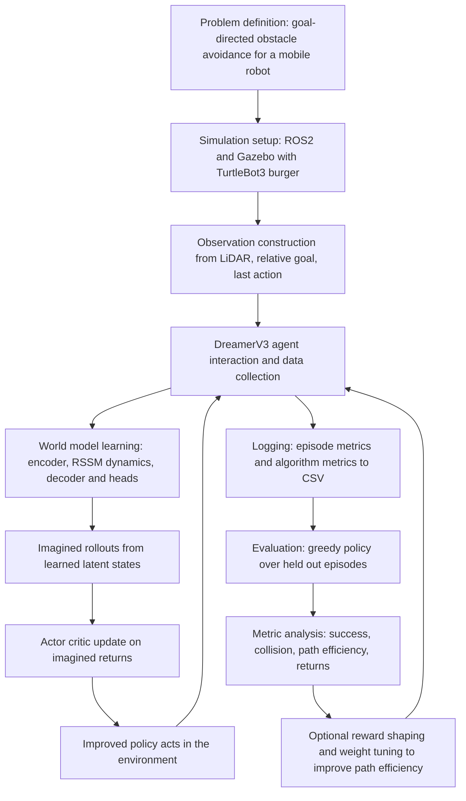
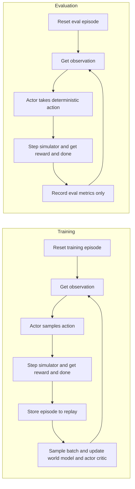

# Research Process Flow

This document describes the end-to-end research process of the DreamerV3-based
autonomous mobile robot navigation study, as realised in the current code. It
covers both the **training flow** and the **evaluation flow**, both of which are
implemented in `dreamerv3-torch/dreamer.py` and `dreamerv3-torch/envs/turtle.py`.

The framing throughout is **DreamerV3-based autonomous mobile robot navigation**:
a TurtleBot3 robot learns, from LiDAR-based observations in a ROS2/Gazebo
simulation, a control policy that drives it to randomly spawned goals while
avoiding obstacles. DreamerV3 is a *model-based* agent: it learns a world model
of the environment and improves its policy primarily inside imagined rollouts of
that model, rather than only from raw environment interaction.

## High-level research process

## Step-by-step explanation

### 1. Problem definition
The study addresses **autonomous point-goal navigation with obstacle
avoidance**. In each episode the robot starts at a fixed origin and must reach a
goal position that is sampled at random within the current stage, terminating
successfully if it arrives within an acceptance radius, and unsuccessfully if it
collides with an obstacle or exceeds a step budget. Stages of increasing
obstacle complexity are used to study how navigation behaviour generalises.

### 2. Simulation setup
The environment is a Gazebo simulation driven through ROS2. The agent process
communicates with the simulator over standard ROS2 interfaces: it **publishes
velocity commands** to `/cmd_vel` and **subscribes to** the laser scanner
`/scan` and odometry `/odom`. Goals are spawned and removed as visual marker
entities, and each episode begins by resetting the simulation. This is
implemented in `Env(Node)` in `envs/turtle.py`.

### 3. Observation construction
At every step the environment forms a single normalised observation from:
LiDAR range readings, the **relative goal** (distance and bearing to the goal in
the robot frame), and the **previous commanded velocity** (linear and angular).
All components are squashed with a hyperbolic-tangent transform into a bounded
range. An optional odometry feature block can be appended. The exact keys and
shapes are documented in
[observation_and_action_space.md](observation_and_action_space.md).

### 4. Agent interaction and data collection
The `Dreamer` agent selects an action for each observation and the
`tools.simulate()` driver steps the environment, accumulating transitions. Full
episodes are written to disk as compressed archives and form a **disk-backed
replay buffer**. A short initial **prefill** phase with random actions seeds the
buffer before learning begins.

### 5. World model learning
DreamerV3 learns a compact latent **world model** (`WorldModel` in `models.py`):
an encoder maps observations to embeddings; a Recurrent State-Space Model (RSSM)
maintains a latent state combining a deterministic recurrent component and a
discrete stochastic component; and decoder/reward/continue heads reconstruct the
observation, predict reward, and predict episode continuation. The world model
is trained on sampled replay batches by jointly minimising reconstruction,
reward, continuation, and latent KL-regularisation objectives.

### 6. Imagined rollouts
Because the world model can predict future latent states and rewards, the agent
**imagines** trajectories forward from real posterior states without touching the
simulator (`ImagBehavior._imagine` in `models.py`). These imagined rollouts are
the substrate on which the policy is improved, which is what makes the method
sample-efficient relative to learning only from environment steps.

### 7. Actor-critic update
Over the imagined rollouts, a **critic** estimates state values and a bootstrapped
lambda-return is computed; an **actor** is then updated to maximise those
returns. This actor-critic improvement is performed entirely inside imagination
(`ImagBehavior._train`, `_compute_target`, `_compute_actor_loss`).

### 8. Improved policy acts in the environment
The updated actor produces the next round of environment actions, generating new
and more informative episodes. Steps 4 through 8 form the **core learning loop**,
repeated until the configured training-step budget is reached.

### 9. Logging
Two complementary families of metrics are recorded to CSV:
- **Black-box** per-episode behavioural metrics (outcome, steps, path
  directness, obstacle clearance, success/collision rates) written by the
  environment.
- **White-box** algorithm-internal metrics (returns, model/actor/value losses,
  latent KL and entropies) written by the `Logger`.
A post-hoc **A\*** path-efficiency metric and per-episode resource costs are also
logged. See
[training_and_evaluation_pipeline.md](training_and_evaluation_pipeline.md).

### 10. Evaluation flow
Periodically the training loop runs an **evaluation** phase using a separate
evaluation environment and a **greedy** (deterministic) policy. Evaluation
episodes are scored independently and written to parallel `*_eval` CSVs, and the
best-performing checkpoint by mean evaluation return is saved.

### 11. Metric analysis
The recorded CSVs are analysed — interactively through the Streamlit dashboard
(`dashboard/app.py`) and offline — to assess success rate, collision rate, path
directness, A\* path efficiency, returns, and compute cost.

### 12. Optional reward shaping and tuning
On the current branch the sparse reward can optionally be augmented with
additive shaping terms (progress, step, turning, and near-obstacle penalties),
and a standalone Optuna Bayesian-optimisation script (`tune_reward.py`) searches
the shaping weights to improve A\* path efficiency subject to not regressing
success rate. This is an **optional research extension**; the agent, observation
space, and action space are unchanged by it.

## Training flow versus evaluation flow

The key differences, both visible in `dreamer.py`: during **training** the actor
**samples** stochastic actions and model updates are interleaved with data
collection; during **evaluation** the actor uses its **deterministic mode**, no
model update occurs, and results are written to evaluation-only CSVs.

> Note (inferred from implementation): the configured exploration behaviour is
> `greedy`, i.e. the task actor itself is used for data collection (no separate
> exploration policy). Alternative exploration behaviours exist in
> `exploration.py` but are **not** active in the default configuration.
