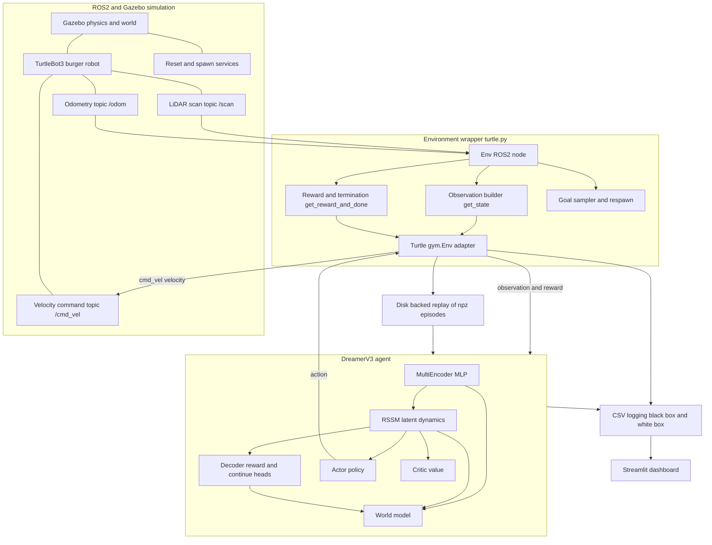

# System Architecture

This document describes the software/system architecture of the current
DreamerV3-based autonomous mobile robot navigation implementation. Every
component shown is present in the source code; nothing is invented. Items that
are interpretations of the code rather than literal artifacts are labelled
**inferred from implementation**.

## Architecture overview

## Component descriptions

### ROS2 and Gazebo simulation
The physical substrate is a Gazebo simulation of a **TurtleBot3 burger** robot in
a stage arena. The agent interacts with it exclusively through ROS2:

- **Subscribed sensor topics:** `/scan` (LiDAR ranges) and `/odom` (pose and
  twist); plus `/imu` (2-D linear acceleration) **only** in the `full_imu` odometry
  mode (conditional — other modes do not subscribe to `/imu`).
- **Published command topic:** `/cmd_vel` (a `geometry_msgs/Twist` with linear
  and angular velocity).
- **Services used:** `/reset_simulation`, `/spawn_entity`, `/delete_entity`,
  `/pause_physics`, `/unpause_physics`, and entity-state services for the goal
  marker.

The pose in `/odom` is **never** passed directly to the policy; it is used only
to compute the relative goal features and the path-length metrics.

### Environment wrapper (`envs/turtle.py`)
Two classes implement the environment:

- **`Env(Node)`** — a ROS2 node that owns the publishers, subscribers, and
  service clients; builds the observation in `get_state()`; computes reward and
  termination in `get_reward_and_done()`; samples and respawns goals; and writes
  the per-episode CSV logs.
- **`Turtle(gym.Env)`** — a Gym adapter that wraps `Env`, declares the
  `observation_space` and `action_space`, and reshapes the flat observation
  vector into the dictionary of observation keys consumed by the agent.

### DreamerV3 agent (`models.py`, `networks.py`, `dreamer.py`)
The agent is composed of a **world model** and an **actor-critic behaviour**:

- **MultiEncoder (MLP):** encodes the dictionary observation into an embedding.
  The encoder is MLP-only for this task; the convolutional path is disabled
  because the observation is vector-valued, not image-valued
  (**inferred from implementation**, from the encoder key configuration).
- **RSSM (Recurrent State-Space Model):** maintains the latent state used for
  prediction and control. It combines a deterministic recurrent component with a
  discrete stochastic component.
- **Decoder / reward / continue heads:** reconstruct the observation, predict the
  reward, and predict whether the episode continues; these supervise the world
  model.
- **Actor and Critic:** the actor outputs a continuous action distribution; the
  critic estimates state value. They are trained over imagined latent rollouts.

The `Dreamer` class in `dreamer.py` ties these together, owns the optimiser
schedule, performs the policy step, and manages checkpointing
(`latest.pt`, `best.pt`).

### Action output and velocity command
The actor produces a 2-dimensional continuous action. The environment maps this
action to a `Twist` velocity and publishes it to `/cmd_vel`, closing the
control loop. The exact mapping is documented in
[observation_and_action_space.md](observation_and_action_space.md).

### Reward computation and termination logic
Reward and episode termination are computed in `get_reward_and_done()`:
a success reward when the goal acceptance radius is reached, a collision penalty
when the minimum LiDAR range drops below a threshold, and a timeout penalty at
the step limit; otherwise zero. This terminal reward is identical under **three
opt-in reward modes** selected by `--reward_mode`: `default` (sparse only),
`shaped` (adds four hand-weighted per-step terms), and `pbrs` (adds one
potential-based, *policy-invariant* term). **All three differ only inside this
environment method** — the world model, actor, critic, observation space, and
action space are byte-for-byte unchanged by the reward mode, so reward shaping
(including PBRS) is **not** an architecture change. See the data-flow diagram and
full details in [reward_shaping.md](reward_shaping.md) and
[training_and_evaluation_pipeline.md](training_and_evaluation_pipeline.md).

### Disk-backed replay
Episodes are saved as compressed `.npz` archives under the run's `train_eps/`
and `eval_eps/` directories and loaded back into an in-memory cache that is
sampled into training batches (`tools.load_episodes`, `sample_episodes`,
`from_generator`, `save_episodes`). The buffer size is bounded by a configured
dataset size. This is a **disk-backed** replay, not a fixed in-memory ring
buffer.

### CSV logging
Per-run metrics are written to CSV in two families:

- **Black-box** behavioural metrics (per episode), written by the environment,
  with separate files for training and evaluation episodes.
- **White-box** algorithm metrics (per logging step), written by the `Logger` in
  `tools.py`.

Additional CSVs record the A\* path-efficiency metric, the reward-component
breakdown, and per-episode compute resource usage. The full schema is in
[training_and_evaluation_pipeline.md](training_and_evaluation_pipeline.md).

### Dashboard (`dashboard/app.py`)
A **Streamlit** dashboard reads the black-box, white-box, planning, and resource
CSVs and renders training curves and per-episode tables. It includes a sidebar
folder picker so that either the main `csv_logs/` directory or a per-experiment
subfolder can be inspected. The dashboard is a **monitoring/analysis** tool; it
does not participate in training.

## Process and threading model (inferred from implementation)

- For the `turtle` task a **single** environment instance is used (`envs: 1`),
  driven synchronously rather than as parallel processes.
- The agent and environment run in the **same Python process**; the environment
  communicates with Gazebo over ROS2, while the agent computes on CPU or CUDA as
  configured.
- Training compute device is selectable at the command line (`cpu` or `cuda`).

## Components intentionally not present

- **No convolutional vision pipeline is used for control.** A placeholder image
  key exists in the observation dictionary but is not part of the
  `observation_space` and is not encoded. Depth-camera/CNN perception is
  **not found in the current implementation**.
- **No model-free critic/policy from TD3, DDPG, SAC, or DQN** participates in
  this architecture; those implementations are legacy and out of scope.
