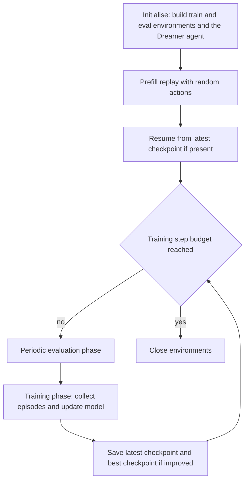
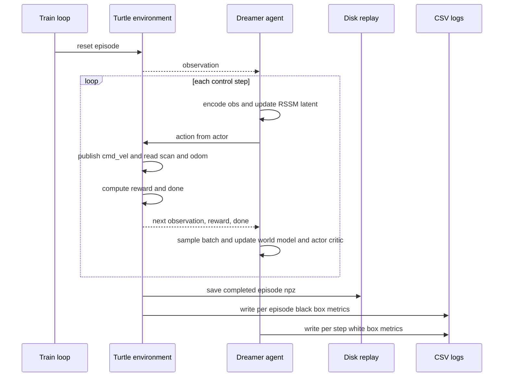

# Training and Evaluation Pipeline

This document describes the training and evaluation pipeline of the DreamerV3
navigation agent, as implemented in `dreamerv3-torch/dreamer.py`,
`dreamerv3-torch/tools.py`, and `dreamerv3-torch/envs/turtle.py`. It also
documents the reward and termination logic and the CSV metric logging, including
the separation of **black-box** and **white-box** metrics.

## Pipeline overview



The loop alternates **evaluation** and **training** phases. Evaluation runs on a
periodic schedule; training collects new episodes and interleaves world-model and
actor-critic updates. After every phase the latest checkpoint is written, and the
best checkpoint by mean evaluation return is preserved.

## Per-step interaction and update



> Note: in the code the model-update steps are scheduled relative to collected
> steps via a train-ratio, and a larger one-off pre-training burst runs before
> the first interaction phase. The sequence above shows the logical interleaving
> of collection and updates rather than an exact per-step count.

## Stages of the pipeline

### 1. Initialisation and prefill
Two environments are created — a **training** environment (`mode = train`) and an
**evaluation** environment (`mode = eval`) — each wrapped as a Gym environment.
A short **prefill** phase drives the training environment with a uniform random
policy to seed the replay buffer before learning begins.

### 2. Replay (disk-backed)
Completed episodes are written as compressed `.npz` archives to the run's
`train_eps/` and `eval_eps/` directories and loaded into a bounded in-memory
cache. Training batches are drawn by sampling fixed-length sub-sequences from the
stored episodes. The buffer is **disk-backed** and bounded by a configured
dataset size; older episodes are erased once the bound is exceeded.

### 3. Model update
Each update consists of two parts:
- **World-model update** — the encoder, RSSM dynamics, and decoder/reward/continue
  heads are trained on a replay batch by minimising reconstruction, reward,
  continuation, and latent KL objectives.
- **Actor-critic update** — starting from the posterior latent states, the agent
  imagines rollouts, computes bootstrapped lambda-returns, fits the critic to
  those returns, and updates the actor to maximise them.

### 4. Action selection
At each environment step the observation is encoded, the RSSM latent state is
advanced, and the actor produces an action — **sampled** during training (for
exploration) and taken at its **deterministic mode** during evaluation.

### 5. Reward and termination
Computed in `get_reward_and_done()` once per step. The episode terminates on one
of three mutually exclusive conditions:

| Condition | Test | Reward (default mode) | Outcome label |
|---|---|---|---|
| **Success** | distance to goal below the acceptance radius (0.4 m) | `+100` | `success` |
| **Collision** | minimum LiDAR range below the collision threshold (0.2 m) | `-10` | `collision` |
| **Timeout** | step counter reaches the per-episode step limit | `-10` | `timeout` |
| Non-terminal step | none of the above | `0` | — |

**Optional reward shaping** (`reward_mode = shaped`) leaves the terminal rewards
unchanged and **adds** four per-step terms:

| Term | Formula | Default weight |
|---|---|---|
| Progress | `scale * (prev_distance - curr_distance)` | `reward_progress_scale = 1.0` |
| Step penalty | `- step_penalty` | `reward_step_penalty = 0.01` |
| Turn penalty | `- turn_penalty * abs(angular_action)` | `reward_turn_penalty = 0.01` |
| Near-obstacle penalty | `- scale * exp(-d_min / sigma)` when `d_min` below 0.3 m | `reward_near_obstacle_scale = 0.1`, `reward_near_obstacle_sigma = 0.25` |

In `default` mode these terms are all zero, so the reward is exactly the original
sparse signal.

### 6. Evaluation protocol
On its periodic schedule the loop runs a fixed number of evaluation episodes
(`eval_episode_num`, default 100) on the **evaluation** environment using the
deterministic actor. Evaluation episodes are scored independently, written to
parallel `*_eval` CSVs, and the checkpoint with the best mean evaluation return
is saved as `best.pt`.

### 7. Checkpointing and resume
After each phase the agent and optimiser states are saved to `latest.pt`. On
startup, if a `latest.pt` exists the run resumes from it. The best evaluation
checkpoint is saved separately as `best.pt`.

## CSV logging: black-box versus white-box

The implementation deliberately separates **behavioural** metrics from
**algorithm-internal** metrics, and separates **training** episodes from
**evaluation** episodes.

### Black-box metrics (per episode, written by the environment)
File `blackbox_{run}.csv` for training and `blackbox_eval_{run}.csv` for
evaluation. Columns:

```
datetime, odometry_mode, stage, episode, outcome,
steps_to_goal, path_directness, min_obstacle_dist, near_collisions,
success_rate, collision_rate,
rolling_success_rate_100, rolling_collision_rate_100,
rolling_success_rate_500, rolling_collision_rate_500
```

These describe **what the robot did** — outcome, efficiency, obstacle clearance,
and running success/collision rates — without reference to the learning
internals. `success_rate`/`collision_rate` are cumulative; the rolling columns
are over the last 100 and 500 episodes.

### White-box metrics (per logging step, written by the Logger)
File `whitebox_{run}.csv`. Columns:

```
datetime, step, train_return, reward_variance,
model_loss, actor_loss, value_loss,
kl, prior_ent, post_ent,
eval_return, eval_success_rate, eval_collision_rate
```

These expose **how the algorithm is learning** — returns, the world-model loss,
the actor and value losses, the latent KL divergence, and the prior/posterior
entropies — alongside reward variance and the evaluation summaries.

> Note (fixed 2026-06-09): the white-box CSV now honours `csv_dir`, so it is
> written to the same directory as the black-box, planning, reward, and resource
> CSVs (default `./csv_logs/`; a tuner run with `--csv_dir ./csv_logs/tune_stage1`
> writes all of them there). Files created before the fix remain in `./csv_logs/`.

### Additional CSVs
- **Planning** (`planning_{run}.csv` / `planning_eval_{run}.csv`): the post-hoc
  **A\*** path-efficiency metric — planned shortest-path length divided by actual
  path length — together with the start/goal coordinates and a planner status.
  Both a goal-region variant and a goal-centre variant are recorded.
- **Reward components** (`reward_{run}.csv` / `reward_eval_{run}.csv`): per-episode
  sums of the terminal and shaping reward terms.
- **Resource** (`resource_{run}.csv` / `resource_eval_{run}.csv`): per-episode
  CPU/RAM/GPU usage and timing.

### Path plots
When the A\* planner returns a valid path, a per-episode overhead plot is rendered
(`envs/path_viz.py`) showing the arena, the A\* reference path, the robot
trajectory, and the goal — training plots and evaluation plots in separate
folders.

## Routing summary

| Phase | Environment mode | Episode archive | Behavioural CSV | Policy |
|---|---|---|---|---|
| Training | `train` | `train_eps/` | `blackbox_{run}.csv` | actor sample |
| Evaluation | `eval` | `eval_eps/` | `blackbox_eval_{run}.csv` | actor deterministic mode |

The same routing applies to the planning, reward, and resource CSVs (training
files versus `*_eval` files). File routing is fixed at environment-construction
time based on the mode, so no per-call mode checks are needed.

> **Supported arena stages: 1–8.** The goal sampler (`_sample_target_position`
> in `turtle.py`) and the A* arena geometry (`STAGE_ARENAS` in `stage_map.py`)
> both cover stages 1–8. Each stage requires its own Gazebo launch file
> (`turtle_stage{N}.py`), and the `--stage N` argument must match the running
> simulation. Stage 7 is a 5×5 m arena with 6 inner walls; stage 8 is a 7.5×7.5 m
> empty arena (same outer walls as stage 5).

> Excluded by scope: this pipeline contains no TD3/DDPG/SAC/DQN training step;
> all updates are DreamerV3 world-model and actor-critic updates.
